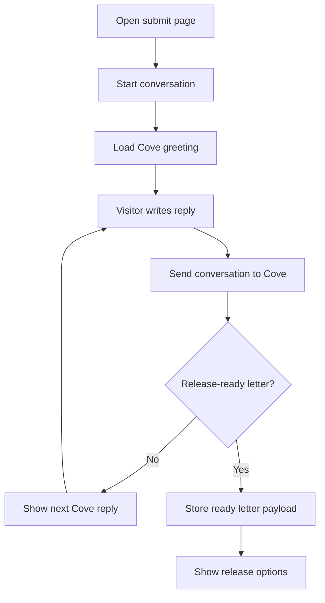
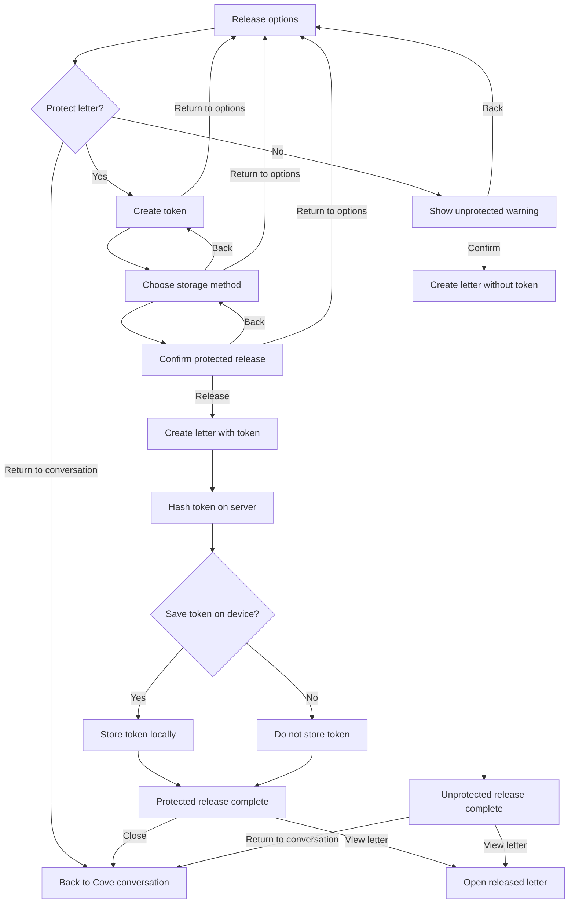
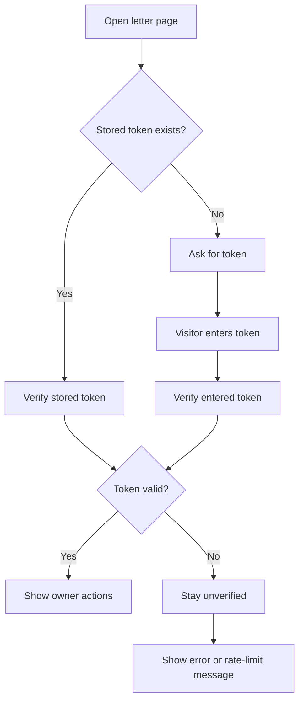
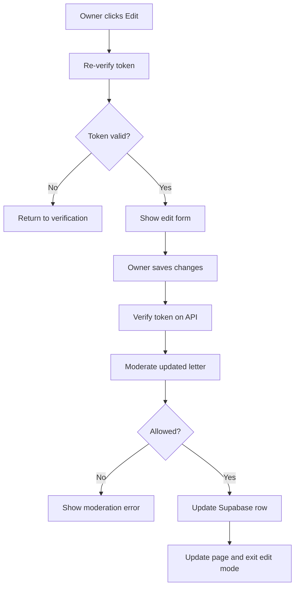
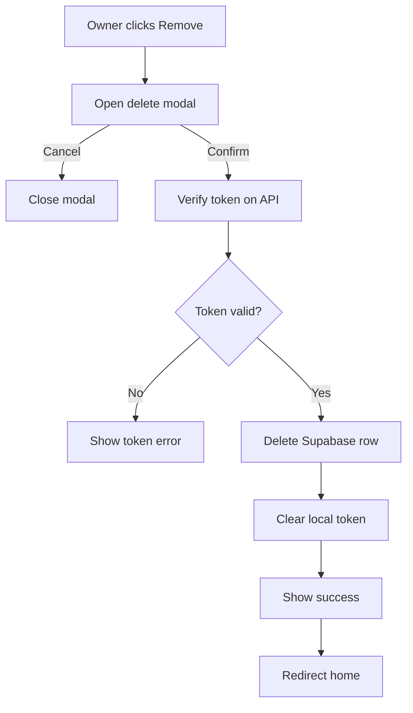

# Letters Unsent

Letters Unsent is a quiet public archive for unsent letters. Visitors can read letters, write with Cove, and release a letter into the archive with optional owner protection for later editing or removal.

The app is built with Next.js App Router, React, TypeScript, Supabase, OpenAI's Responses API, and Sentry.

## Current Status

- The public archive, individual letter pages, About page, and Changelog page are implemented.
- Cove's guided writing and submit flow is open at `/submit`.
- Writers can submit a letter with or without owner protection.
- Protected letters use a private token so the owner can edit or remove the letter later.
- The writing flow, owner controls, and navigation include mobile, keyboard, screen reader, contrast, focus, and reduced-motion refinements.

## Local Setup

Install dependencies:

```bash
npm install
```

Create a local environment file with the variables listed below, then start the development server:

```bash
npm run dev
```

Open [http://localhost:3000](http://localhost:3000).

Most page work lives under `src/app`. Shared UI lives under `src/components`.

## Environment Variables

```text
NEXT_PUBLIC_SUPABASE_URL=
NEXT_PUBLIC_SUPABASE_ANON_KEY=
SUPABASE_API_URL=
OPENAI_LETTERS_UNSENT_API_KEY_GUARDIAN=
```

- `NEXT_PUBLIC_SUPABASE_URL` - Supabase project URL.
- `NEXT_PUBLIC_SUPABASE_ANON_KEY` - Supabase anonymous key used by the app.
- `SUPABASE_API_URL` - Base URL for the app's Supabase API route. Locally this is usually `http://localhost:3000/api/supabase`.
- `OPENAI_LETTERS_UNSENT_API_KEY_GUARDIAN` - OpenAI API key used by Cove and archive moderation.

## Useful Scripts

- `npm run dev` - Starts the local development server.
- `npm run build` - Builds the production app.
- `npm run start` - Runs the built production app.
- `npm run lint` - Runs the configured Next.js lint command.
- `npm run test` - Runs Jest tests.
- `npm run test:watch` - Runs Jest in watch mode.
- `npm run test:e2e` - Runs Playwright end-to-end tests.

## App Routes

- `/` - Public archive of letter previews.
- `/about` - Project background, guidelines, privacy notes, roadmap, and contact information.
- `/changelog` - Release notes and visible product changes.
- `/submit` - Cove writing conversation and letter release flow.
- `/letters/[letterId]` - Full single-letter view, including owner management controls.

## API Routes

- `GET /api/supabase` - Fetches all letters for the archive.
- `POST /api/supabase` - Creates a new letter, with an optional hashed owner token.
- `GET /api/supabase/singleLetter?letterId=...` - Fetches one letter.
- `POST /api/supabase/singleLetter` - Verifies a letter owner's token.
- `PUT /api/supabase/singleLetter` - Updates a verified owner's letter after moderation.
- `DELETE /api/supabase/singleLetter?letterId=...` - Removes a verified owner's letter.
- `GET /api/guardian` - Gets Cove's opening message.
- `POST /api/guardian` - Sends the writing conversation to Cove and receives either a reply or a release-ready letter payload.
- `POST /api/events` - Minimal event endpoint that echoes `email.received` payloads.
- `GET /api/sentry-example-api` - Intentionally throws an error for Sentry testing.

## Architecture Maps

These maps are intentionally overlapping. The master map is the quickest orientation point, the component map explains the render tree in plain language, the state map shows where important state lives, and the flow maps show what happens over time.

### Master Architecture Map

This map combines route-level components, important state, and key event handlers. It intentionally excludes minor presentational markup and purely visual props.

```text
Letters Unsent App
├─ RootLayout
│  renders: NavBar + active route page
│
├─ NavBar
│  state: showModal, windowInnerWidth
│  renders:
│    desktop width -> Release A Letter link, FeatherIcon, About & Contact link
│    mobile width -> EnvelopeClosedIcon button
│    showModal=true -> NavigationModal dialog with contained focus
│
├─ Home Page `/`
│  state: letters, responseOk, errorMessage
│  functions: loadAllLetters(), determineLetterDisplay()
│  API: GET /api/supabase
│  renders: ErrorDisplay, Spinner, letter preview links, AIGenTag, Footer
│
├─ About Page `/about`
│  state: toggleBackground, toggleGuidelines, togglePrivacy, toggleRoadmap, toggleContact
│  renders: Toggle sections + Footer from AboutLayout
│
├─ Changelog Page `/changelog`
│  state: none
│  renders: Changelog + Footer from ChangelogLayout
│
├─ Submit Page `/submit`
│  loading: RouteLoading
│  └─ Submit
│     state:
│       coveMessage, visitorInput, conversation, responseOk, errorMessage
│       conversationStart, isComposing, isComposerExpanded
│       pendingReleasePayload, releaseLocked
│     functions:
│       greetVisitor(), handleSubmit(), handleSubmitLetter()
│       returnToConversation(), startNewLetterFlow()
│     hook: useConversationViewport()
│     APIs:
│       GET /api/guardian
│       POST /api/guardian
│       POST /api/supabase
│     renders:
│       Start conversation button
│       GuardianPanel -> Spinner while Cove is loading
│       VisitorPanel in compact or expanded mode while no release payload exists
│       ReleaseActionArea once Cove returns a release-ready payload
│
│     └─ ReleaseActionArea
│        state: mode, isSubmitting, errorMessage, releasedLetterId
│        functions: handleSubmitUnprotected()
│        renders by mode:
│          idle -> ReleaseChoicePanel
│          warn-unprotected -> NoProtectionWarningStep
│          protect -> ProtectionFlow
│          released -> ReleaseSuccessPanel
│
│        └─ ProtectionFlow
│           state:
│             step, passphraseMode, customPassphrase, generatedPassphrase
│             saveOnDevice, manualSaveSelected, tokenCopied
│             savedElsewhereConfirmed, releasedLetterId, isSubmitting, submitError
│           functions:
│             handleSelectCustom(), handleSelectGenerated(), handleGenerateAnother()
│             handleContinueFromCreate(), handleCopyToken()
│             handleContinueFromStore(), handleConfirmRelease()
│           renders by step:
│             create -> CreatePassphraseStep -> ProtectionStepShell
│             store -> StorePassphraseStep -> ProtectionStepShell
│             confirm -> ConfirmProtectedReleaseStep -> ProtectionStepShell
│             confirmed -> ProtectionConfirmedStep -> ProtectionStepShell
│
└─ Single Letter Page `/letters/[letterId]`
   loading: RouteLoading
   └─ LetterPage
      server data: fetched letter response
      API: GET /api/supabase/singleLetter
      renders: ErrorDisplay or LetterViewWrapper

      └─ LetterViewWrapper
         state:
           isEditing, ownerPassphrase, currentLetter
           isDesktopOwnerRailSurface, showDesktopOwnerRail, desktopRailMountNode
         functions:
           handleSavedLetter(), handleStartEditing(), handleCancelEditing()
         renders:
           LetterOwnerArea
           isEditing=false -> LetterView
           isEditing=true -> LetterEditForm
           desktop balance rail + owner rail on wide screens

         ├─ LetterOwnerArea
         │  state:
         │    isExpanded, isManaging, isCheckingEdit, mobileSheetMode
         │    isDeleteModalOpen, isDeleting, deleteErrorMessage, deleteSuccess
         │  verification state from useOwnerVerification:
         │    tokenInput, verificationMessage, isVerifying, isVerified, verifiedPassphrase
         │  functions:
         │    handleConfirmToken(), handleEditing(), handleCancelEdit()
         │    handleOpenDeleteModal(), handleConfirmDelete()
         │  APIs:
         │    POST /api/supabase/singleLetter
         │    DELETE /api/supabase/singleLetter
         │  renders:
         │    OwnerVerificationPanel, OwnerActions, OwnerEditActions
         │    DesktopEditPocket, MobileOwnerSheet, DeleteConfirmationModal
         │
         ├─ LetterView
         │  props: letter=currentLetter
         │  state: none
         │  renders:
         │    date, recipient when present, content, author sign-off when present
         │
         └─ LetterEditForm
            props:
              letterId, formId, ownerPassphrase, initialLetter
              onCancel, onSaveSuccess
            state:
              content, intendedRecipient, authorName, isSaving
              isOwnerTokenRejected, saveMessage, errorMessage
              isModerationError, moderationRejectCount
            functions: handleSubmit(), resizeContentTextarea()
            API: PUT /api/supabase/singleLetter
```

### Component Map

This map follows the app shell first, then each route. Indented items sit inside the item above them. Some items only appear in certain states, such as mobile navigation, loading, editing, or after a letter is ready to release.

```text
Letters Unsent App - The full website experience.
├─ RootLayout - Wraps every page and keeps shared fonts, styles, and navigation in place.
│  ├─ NavBar - Lets visitors move around the site.
│  │  ├─ desktop navigation - Shows full navigation links on wider screens.
│  │  │  ├─ Home link - Takes visitors back to the letter archive.
│  │  │  ├─ Release A Letter link - Opens the writing and release flow.
│  │  │  ├─ FeatherIcon - Adds the small visual divider in the desktop nav.
│  │  │  └─ About & Contact link - Opens project information and contact details.
│  │  └─ mobile navigation - Shows a compact menu on smaller screens.
│  │     ├─ EnvelopeClosedIcon - Opens the mobile menu.
│  │     └─ NavigationModal - Shows mobile navigation links in a dialog, contains keyboard focus, and returns focus when closed.
│  │        ├─ EnvelopeOpenIcon - Closes the mobile menu.
│  │        ├─ Home link - Takes visitors back to the letter archive.
│  │        ├─ Release A Letter link - Opens the writing and release flow.
│  │        ├─ About & Contact link - Opens project information and contact details.
│  │        └─ Changelog link - Opens the release notes.
│  │
│  ├─ Home Page `/` - Shows the public archive of letters.
│  │  ├─ ErrorDisplay - Shows a plain message if letters fail to load.
│  │  ├─ Spinner - Shows that the letter list is still loading.
│  │  ├─ Letter preview list - Shows shortened versions of each letter.
│  │  │  └─ AIGenTag - Marks letters that were generated by AI.
│  │  │     └─ Tag - Renders a small reusable label.
│  │  └─ Footer - Shows site links, version, and release information.
│  │
│  ├─ About Page `/about` - Explains the project and its policies.
│  │  └─ AboutLayout - Adds About page metadata and the footer.
│  │     ├─ About - Holds expandable project information sections.
│  │     │  ├─ Toggle: Background - Opens or closes the project background section.
│  │     │  ├─ Toggle: Submission Guidelines - Opens or closes the writing rules section.
│  │     │  ├─ Toggle: Privacy & Use - Opens or closes the privacy information section.
│  │     │  ├─ Toggle: Roadmap & Features - Opens or closes planned features.
│  │     │  └─ Toggle: Contact - Opens or closes contact information.
│  │     └─ Footer - Shows site links, version, and release information.
│  │
│  ├─ Changelog Page `/changelog` - Lists visible changes over time.
│  │  └─ ChangelogLayout - Adds Changelog page metadata and the footer.
│  │     ├─ Changelog - Shows version notes and release history.
│  │     └─ Footer - Shows site links, version, and release information.
│  │
│  ├─ Submit Page `/submit` - Handles writing, conversation, and releasing a letter.
│  │  └─ SubmitLayout - Adds Submit page metadata.
│  │     ├─ Loading - Uses RouteLoading for an announced, centred loading state.
│  │     └─ Submit - Runs the Cove conversation and publishing flow.
│  │        ├─ useConversationViewport - Keeps the conversation usable around mobile keyboards and scroll boundaries.
│  │        ├─ ErrorDisplay - Shows a plain message if the flow fails.
│  │        ├─ Start conversation button - Begins the writing conversation.
│  │        └─ Conversation area - Shows the active writing session.
│  │           ├─ GuardianPanel - Shows Cove's message or a loading state.
│  │           │  └─ Spinner - Shows that Cove is still replying.
│  │           ├─ VisitorPanel - Lets the visitor write, switch between compact and expanded modes, and send replies.
│  │           │  ├─ MaximiseIcon - Expands the writing box.
│  │           │  ├─ MinimiseIcon - Shrinks the writing box.
│  │           │  └─ RespondIcon - Sends the visitor's reply.
│  │           └─ ReleaseActionArea - Guides the visitor once a letter is ready.
│  │              ├─ ReleaseChoicePanel - Asks whether to protect the letter or release it plainly.
│  │              ├─ NoProtectionWarningStep - Warns that unprotected letters cannot be managed later.
│  │              ├─ ReleaseSuccessPanel - Confirms the letter has been released.
│  │              └─ ProtectionFlow - Guides the private token setup.
│  │                 ├─ CreatePassphraseStep - Lets the visitor write or generate a token.
│  │                 │  └─ ProtectionStepShell - Provides the shared protection-step layout.
│  │                 ├─ StorePassphraseStep - Helps the visitor save or copy the token.
│  │                 │  └─ ProtectionStepShell - Provides the shared protection-step layout.
│  │                 ├─ ConfirmProtectedReleaseStep - Asks the visitor to confirm the protected release.
│  │                 │  └─ ProtectionStepShell - Provides the shared protection-step layout.
│  │                 └─ ProtectionConfirmedStep - Confirms the protected release is complete.
│  │                    └─ ProtectionStepShell - Provides the shared protection-step layout.
│  │
│  └─ Single Letter Page `/letters/[letterId]` - Shows one full letter.
│     └─ SingleLetterLayout - Wraps the single-letter view and footer.
│        ├─ Loading - Uses RouteLoading for an announced, centred loading state.
│        ├─ LetterPage - Fetches the selected letter and handles load errors.
│        │  ├─ ErrorDisplay - Shows a plain message if the letter cannot load.
│        │  └─ LetterViewWrapper - Keeps the letter centered, switches between reading and editing, and controls the desktop owner rail.
│        │     ├─ desktop balance rail - Reserves empty space on desktop so the letter stays centered beside the right rail.
│        │     ├─ main letter column - Holds the letter metadata, top owner controls, and active letter surface.
│        │     │  ├─ AIGenTag - Marks letters that were generated by AI.
│        │     │  │  └─ Tag - Renders a small reusable label.
│        │     │  ├─ LetterOwnerArea - Handles ownership checks, top owner controls, and duplicate desktop rail actions.
│        │     │  │  ├─ OwnerVerificationPanel - Lets a visitor enter their private token.
│        │     │  │  ├─ OwnerActions - Offers edit, remove, or cancel after ownership is verified.
│        │     │  │  ├─ OwnerEditActions - Offers save or cancel while editing.
│        │     │  │  ├─ DesktopEditPocket - Shows duplicate save and cancel actions in the desktop rail after the top controls scroll away.
│        │     │  │  │  └─ OwnerEditActions - Offers save or cancel while editing.
│        │     │  │  ├─ MobileOwnerSheet - Shows owner controls in a bottom sheet on mobile.
│        │     │  │  │  └─ OwnerVerificationPanel / OwnerActions / OwnerEditActions - Shows the right owner control for the current state.
│        │     │  │  └─ DeleteConfirmationModal - Confirms before permanently removing a letter.
│        │     │  ├─ LetterView - Shows the letter for normal reading.
│        │     │  └─ LetterEditForm - Lets a verified owner change letter text and details.
│        │     └─ desktop owner rail - Receives duplicate owner or edit controls on desktop after the top controls scroll away.
│        └─ Footer - Shows site links, version, and release information.
│
├─ GlobalError - Catches serious app-level errors.
│  └─ NextError - Shows Next.js's fallback error page.
│
└─ Existing but not currently used on a page
   ├─ ContactForm - Draft contact form that is not currently mounted.
   └─ ExportLetterButton - Empty placeholder file for a possible export feature.
```

### State Ownership Map

This map focuses on where important UI and flow state lives. Presentational components with no meaningful state are omitted unless they receive state through props.

```text
Global / Shell
├─ RootLayout
│  owns: no React state
│  provides: shared fonts, global styles, NavBar
│
└─ NavBar
   owns:
     showModal - whether the mobile navigation modal is open
     windowInnerWidth - measured browser width used to choose desktop or mobile navigation
   passes:
     onClose -> NavigationModal

Archive
└─ Home Page `/`
   owns:
     letters - loaded archive rows
     responseOk - loading/success gate for archive fetch
     errorMessage - archive load failure message
   decides:
     Spinner vs empty state vs letter preview list

Static Pages
├─ About Page `/about`
│  owns:
│    toggleBackground
│    toggleGuidelines
│    togglePrivacy
│    toggleRoadmap
│    toggleContact
│  decides:
│    which Toggle panels are open
│
└─ Changelog Page `/changelog`
   owns: no React state

Submit / Release
└─ Submit
   owns:
     coveMessage - latest Cove text shown in GuardianPanel
     visitorInput - current visitor response draft
     conversation - system/user/assistant messages sent to Cove
     responseOk - Cove loading/success gate
     errorMessage - submit flow failure message
     conversationStart - start button vs active conversation
     isComposing - whether the visitor input currently has focus
     isComposerExpanded - compact vs expanded writing mode
     pendingReleasePayload - release-ready letter payload from Cove
     releaseLocked - prevents another release from the same ready payload
   decides:
     start view vs conversation view
     VisitorPanel vs ReleaseActionArea
     compact vs expanded conversation layout
   side effects:
     useConversationViewport keeps the active conversation above mobile keyboards
     and contains touch scrolling at conversation boundaries

   ├─ VisitorPanel
   │  owns refs:
   │    textareaRef - active writing control
   │    pendingEditorStateRef - focus, selection, and scroll state to restore
   │    modeSnapshotRef - compact and expanded editor snapshots
   │  handles:
   │    mobile textarea resizing and keyboard-safe focus
   │    focus, selection, and scroll preservation when changing modes
   │
   └─ ReleaseActionArea
      owns:
        mode - release choice, protected flow, unprotected warning, or success
        isSubmitting - unprotected release submission lock
        errorMessage - release submission error
        releasedLetterId - created letter id for success navigation
      decides:
        ReleaseChoicePanel vs NoProtectionWarningStep vs ProtectionFlow vs ReleaseSuccessPanel

      └─ ProtectionFlow
         owns:
           step - create, store, confirm, or confirmed
           passphraseMode - custom or generated
           customPassphrase
           generatedPassphrase
           saveOnDevice
           manualSaveSelected
           tokenCopied
           savedElsewhereConfirmed
           releasedLetterId
           isSubmitting
           submitError
         decides:
           which protected-release step renders
           whether the visitor can continue to the next step
           whether the token is saved to localStorage after protected release

Single Letter / Owner Management
└─ LetterViewWrapper
   owns:
     isEditing - read mode vs edit mode
     ownerPassphrase - verified token currently held for edit session
     currentLetter - current client-side letter data after saves
     isDesktopOwnerRailSurface - whether desktop rail behavior is active
     showDesktopOwnerRail - whether the duplicate desktop rail controls should appear
     desktopRailMountNode - portal target for desktop rail content
   decides:
     LetterView vs LetterEditForm
     whether desktop owner rail exists

   ├─ LetterOwnerArea
   │  owns:
   │    isExpanded - desktop verification panel visibility
   │    isManaging - desktop owner action panel visibility
   │    isCheckingEdit - edit re-verification lock
   │    mobileSheetMode - closed, open-unverified, open-verified, or editing
   │    isDeleteModalOpen
   │    isDeleting
   │    deleteErrorMessage
   │    deleteSuccess
   │  receives:
   │    isEditing, editFormId, onEdit, onCancelEdit, desktop rail flags
   │  decides:
   │    verification panel vs owner actions vs edit actions
   │    inline controls vs mobile sheet vs desktop rail portal
   │    delete modal state
   │
   │  └─ useOwnerVerification
   │     owns:
   │       tokenInput
   │       verificationMessage
   │       isVerifying
   │       isVerified
   │       verifiedPassphrase
   │     side effects:
   │       silently verifies stored localStorage token on mount
   │       writes valid token to localStorage
   │       clears rejected stored token from localStorage
   │
   └─ LetterEditForm
      owns:
        content
        intendedRecipient
        authorName
        isSaving
        isOwnerTokenRejected
        saveMessage
        errorMessage
        isModerationError
        moderationRejectCount
      receives:
        letterId, ownerPassphrase, initialLetter, onCancel, onSaveSuccess
      decides:
        save button state
        owner-token rejection state
        moderation rejection help text
```

### Flow Maps

These maps show user actions, component boundaries, API routes, and data side effects over time. The README versions are intentionally abbreviated so they render cleanly inline. Fuller standalone Mermaid files for printing/exporting live in `docs/diagrams`.

#### Submit To Release-Ready Flow



#### Release Flow



#### Owner Verification Flow



#### Owner Edit Flow



#### Owner Delete Flow



## Data, Moderation, and Observability

- Public letters are stored in the Supabase `letter` table.
- The archive page fetches letters through `GET /api/supabase`.
- Single-letter pages fetch through `GET /api/supabase/singleLetter`.
- Cove uses OpenAI's Responses API to guide the visitor through drafting a letter.
- The active Cove conversation is held in client state and is not saved to the project's database.
- Conversation requests sent through `POST /api/guardian` use `store: false`, so response objects are not retained for later retrieval through the Responses API.
- OpenAI may still retain prompts and responses in abuse-monitoring logs for up to 30 days by default, or longer where required by law or necessary to protect its services or third parties. See [OpenAI's data controls documentation](https://developers.openai.com/api/docs/guides/your-data#data-retention-controls-for-abuse-monitoring).
- When Cove decides a letter is ready, `/api/guardian` returns a release-ready payload for the submit page.
- Releasing a protected letter stores only a hashed owner token. The plain token is shown to the visitor and may be saved locally in their browser if they choose.
- Owner edit and delete actions verify the token before changing stored data.
- Edited letters are checked by `moderateLetterForArchive` before updates are accepted.
- Sentry error monitoring is enabled for the client, server, and edge runtime. The current configuration uses `sendDefaultPii: true`, which permits default personally identifiable information to be attached where supported by the SDK; this setting should be reviewed against the project's privacy requirements.

## Known Placeholders

- `src/components/ContactForm.tsx` exists but is not currently mounted on any page.
- `src/components/LetterSubmit/ExportLetterButton.tsx` is an empty placeholder.
- `src/app/api/events/route.ts` is a minimal event echo endpoint rather than a complete webhook integration.
- `src/app/api/sentry-example-api/route.ts` deliberately throws an error for Sentry testing.
- Some icon files in `public/icons` appear to be older or duplicate variants.
